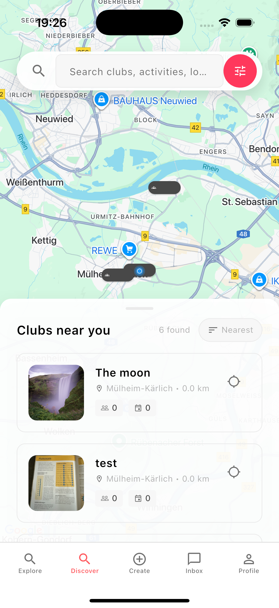

# ClubJoin - Deployment Guide

## 🚀 Deployment-Modi

### **1. Fallback Modus (aktuell aktiv)**
Für das erste Deployment ohne echte App-Screenshots:

- ✅ **Pulsing ClubJoin Logo** in allen Handys
- ✅ **"Coming Soon..." Text** mit Animation
- ✅ **Dunkler Hintergrund** mit ClubJoin-Brand-Gradienten
- ✅ **Kein JavaScript** Screenshot-Wechsel nötig

### **2. Screenshot Modus (für später)**
Wenn echte App-Screenshots verfügbar sind:

- 🔄 **Wechselnde Screenshots** basierend auf Scroll-Position
- 📱 **Echte App-Previews** zeigen Features
- ⚡ **Interaktive Erfahrung** für User

## 🔧 Zwischen Modi wechseln:

### **Fallback → Screenshots (wenn App fertig ist):**

1. **Kommentierte Zeilen aktivieren:**
```html
<!-- Aktiviere diese Zeilen: -->



```

2. **Fallback-Elemente deaktivieren:**
```html
<!-- Kommentiere diese aus: -->
<!-- 
<div class="phone-fallback" id="heroPhoneImg">
    
    <div class="coming-soon-text">Coming Soon</div>
</div> 
-->
```

3. **Screenshots hinzufügen:**
- `assets/search.png` - Suchfunktion
- `assets/club.png` - Vereinsübersicht  
- `assets/members.png` - Mitgliederbereich

### **Screenshots → Fallback (zurück wechseln):**

1. **Fallback-Elemente aktivieren** (auskommentieren)
2. **Screenshot-Elemente deaktivieren** (einkommentieren)

## 🎨 Fallback Design Features:

### **Animationen:**
- **Logo pulsing**: 2s ease-in-out infinite
- **Text fade**: 3s fade-in-out infinite  
- **Background**: Subtile ClubJoin-Brand-Gradienten

### **Responsive:**
- **Desktop**: 80px Logo, 16px Text
- **Small phones**: 50px Logo, 12px Text
- **Mobile**: 60px Logo, 14px Text

### **Farben:**
- **Hintergrund**: Dunkler Gradient (#1a1a1a → #2d2d2d)
- **Logo**: Original ClubJoin Logo mit Drop-Shadow
- **Text**: Weiß mit Text-Shadow
- **Akzente**: ClubJoin Red (#dc474b) als Gradient-Overlays

## 📱 Aktueller Status:

```
🎨 FALLBACK MODUS AKTIV
   ├── Hero Phone: Pulsing Logo + "Coming Soon"
   ├── Preview Phone 1: Pulsing Logo + "Coming Soon"  
   ├── Preview Phone 2: Pulsing Logo + "Coming Soon"
   └── JavaScript: Screenshot-System automatisch deaktiviert
```

## 🚀 Production Deployment:

### **1. Sofort deployment-ready:**
- ✅ Fallback-Modus ist vollständig functional
- ✅ Sieht professionell aus mit Brand-Konsistenz  
- ✅ Mobile-optimiert und responsive
- ✅ Kein Bedarf für echte App-Screenshots

### **2. Später upgraden:**
- 📱 App-Screenshots hinzufügen
- 🔄 Screenshot-Wechsel aktivieren
- ✨ Interaktive Features einschalten

## ⚡ Quick Switch Commands:

### **Activate Fallback:**
```bash
# Aktiviere Fallback (aktueller Zustand)
# Bereits aktiv - nichts zu tun!
```

### **Activate Screenshots:**
```bash
# Wenn Screenshots verfügbar sind:
# 1. Screenshots zu assets/ Ordner hinzufügen
# 2. HTML Comments umdrehen
# 3. PhoneScreenshotManager aktiviert sich automatisch
```

**Der Fallback-Modus ist vollständig production-ready und sieht professionell aus! 🎯**